# AgentMesh Architecture

> Trust-first communication layer for AI agents — cryptographic identity,
> multi-dimensional trust scoring, scope chains, and governance enforcement.

## 1. Overview

AgentMesh provides a **4-layer trust stack** that lets autonomous AI agents
discover, authenticate, and collaborate with each other while maintaining
cryptographic accountability and policy compliance at every hop.

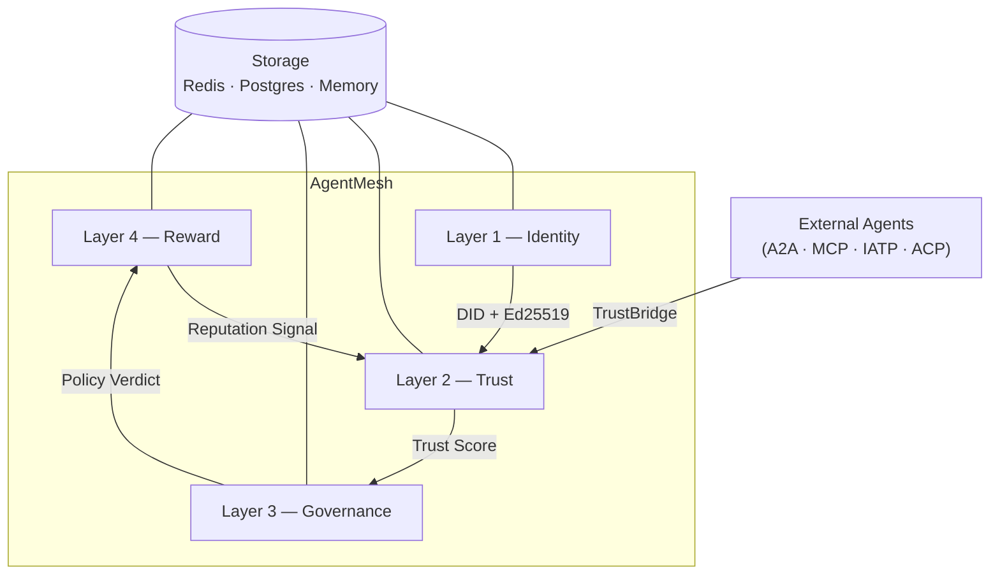

### Module Map

```text
src/agentmesh/
├── identity/        # Layer 1 — DID, credentials, delegation, SPIFFE
├── trust/           # Layer 2 — scoring, handshake, bridge, capability
├── governance/      # Layer 3 — policy, OPA, audit, compliance, shadow
├── reward/          # Layer 4 — engine, scoring, trust decay, anomaly
├── integrations/    # Protocol adapters (A2A, MCP, LangFlow, …)
├── storage/         # Pluggable backend (Redis, Postgres, memory)
├── services/        # Backend services
├── cli/             # CLI commands
├── core/            # Shared core types
└── observability/   # Metrics and tracing
```

---

## 2. 4-Layer Trust Stack

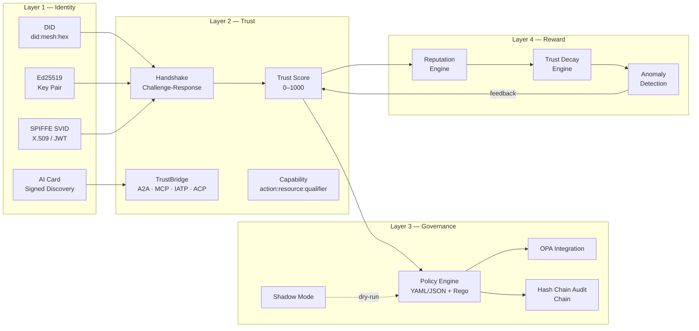

### Layer Details

| Layer | Responsibility | Key Modules |
|-------|---------------|-------------|
| **1 — Identity** | Ed25519 key pairs, DID generation (`did:mesh:<hex>`), SPIFFE mTLS, AI Card discovery, scope chains | `identity/` |
| **2 — Trust** | 5-dimension trust scoring (0–1000), 3-phase handshake (<200 ms), TrustBridge protocol unification, capability grants | `trust/` |
| **3 — Governance** | Declarative policy rules (<5 ms), OPA/Rego integration, hash chain audit trails, compliance mapping (EU AI Act, SOC 2, HIPAA, GDPR), shadow mode | `governance/` |
| **4 — Reward** | Reputation engine, weighted scoring, trust decay (2 pts/hr), anomaly detection (5 classes) | `reward/` |

---

## 3. Identity Lifecycle

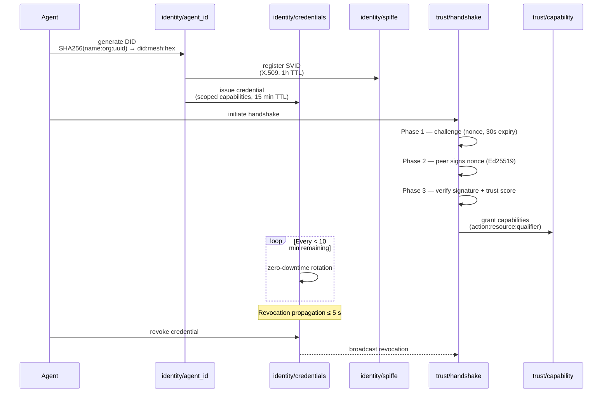

### Key Parameters

| Parameter | Value | Source |
|-----------|-------|--------|
| DID format | `did:mesh:<32-char-hex>` | `identity/agent_id.py` |
| Key algorithm | Ed25519 | `identity/agent_id.py` |
| Credential TTL | 15 min (configurable) | `identity/credentials.py` |
| SVID TTL | 1 h (rotate at <10 min) | `identity/spiffe.py` |
| Handshake expiry | 30 s nonce | `trust/handshake.py` |
| Handshake cache TTL | 15 min | `trust/handshake.py` |
| Revocation propagation | ≤ 5 s | `identity/credentials.py` |
| Sponsor max agents | 10 (default) | `identity/sponsor.py` |
| Max delegation depth | 3 (default) | `identity/sponsor.py` |

---

## 4. Trust Scoring Model

### 5 Dimensions

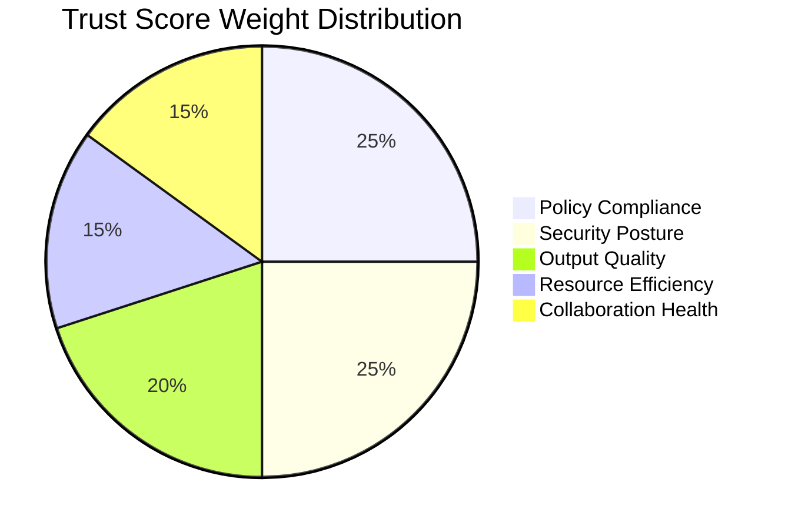

| Dimension | Weight | Description |
|-----------|--------|-------------|
| Policy Compliance | 25 % | Adherence to governance rules |
| Security Posture | 25 % | Credential hygiene, vulnerability posture |
| Output Quality | 20 % | Task success rate, accuracy |
| Resource Efficiency | 15 % | Compute/token usage vs. budget |
| Collaboration Health | 15 % | Responsiveness, protocol compliance |

### Thresholds & Tiers

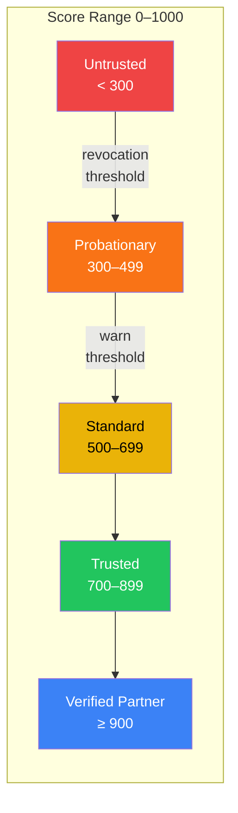

| Threshold | Score | Action |
|-----------|-------|--------|
| Revocation | < 300 | Credentials revoked, peer blacklisted |
| Warning | < 500 | Alert raised, capabilities restricted |
| Allow | ≥ 500 | Normal operation |
| Trusted bridge | ≥ 700 | TrustBridge default threshold |

### Trust Decay Model

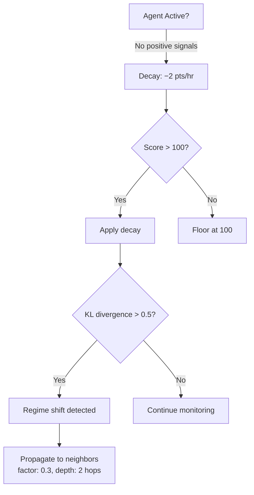

| Parameter | Value |
|-----------|-------|
| Decay rate | 2.0 pts / hour |
| Minimum floor | 100 |
| Propagation factor | 0.3 |
| Propagation depth | 2 hops |
| Regime threshold (KL divergence) | 0.5 |
| Recent window | 1 hour |
| Baseline window | 30 days |

### Anomaly Detection

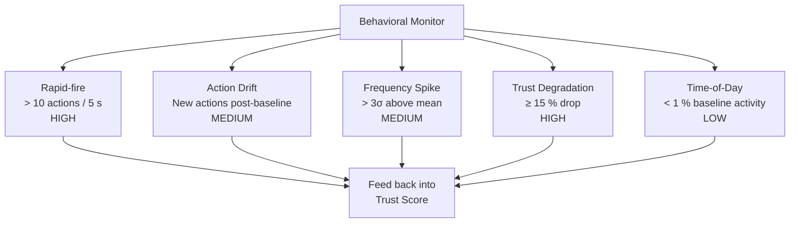

---

## 5. Governance Engine Flow

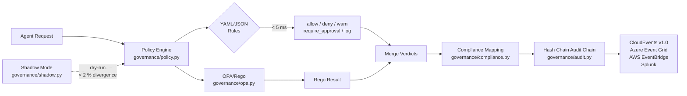

### Governance Submodules

| Submodule | File | Purpose |
|-----------|------|---------|
| **Policy** | `governance/policy.py` | Declarative YAML/JSON rules with rate limiting |
| **OPA** | `governance/opa.py` | Rego policy evaluation (Kubernetes-familiar) |
| **Compliance** | `governance/compliance.py` | Maps actions → EU AI Act, SOC 2, HIPAA, GDPR controls |
| **Audit** | `governance/audit.py` | hash chain tree audit chain, tamper-evident, CloudEvents export |
| **Persistent Audit** | `governance/persistent_audit.py` | Durable audit log storage |
| **Shadow** | `governance/shadow.py` | Test new policies in parallel; batch replay support |

### Policy Evaluation Order

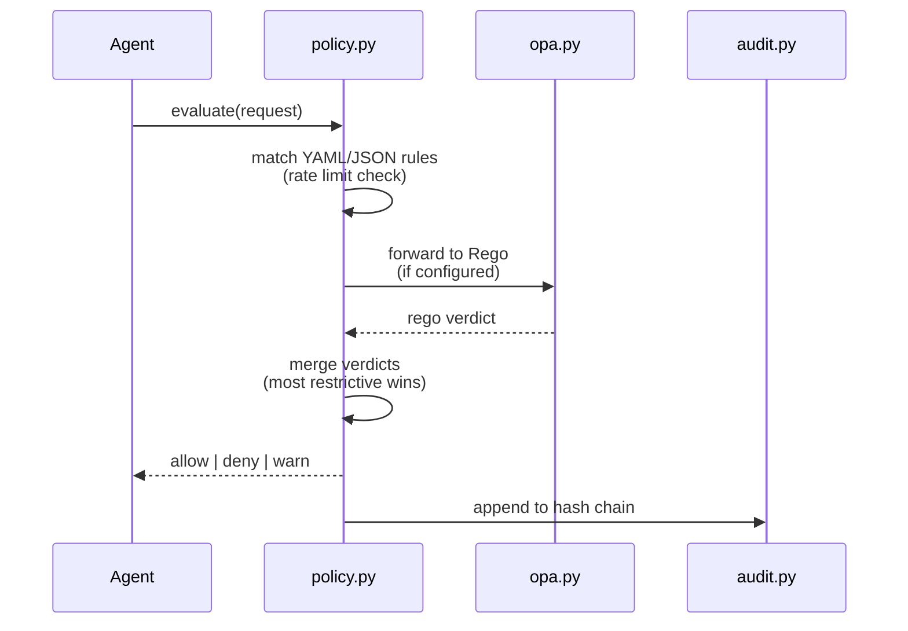

---

## 6. Protocol Bridge Architecture

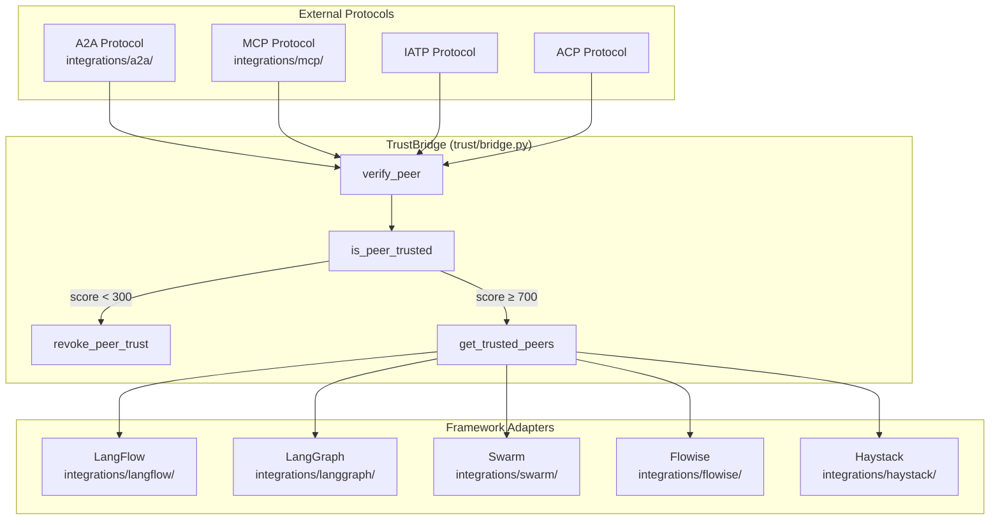

### Bridge Operations

| Operation | Method | Description |
|-----------|--------|-------------|
| Verify peer | `verify_peer()` | Core trust gate — validates identity + trust score before communication |
| Check trust | `is_peer_trusted()` | Quick boolean check against threshold (default 700) |
| Revoke trust | `revoke_peer_trust()` | Instant trust revocation, propagated across mesh |
| List trusted | `get_trusted_peers()` | Filter peers by minimum trust score |

### Integration Submodules

| Submodule | Path | Protocol |
|-----------|------|----------|
| A2A | `integrations/a2a/` | Google A2A agent-to-agent |
| MCP | `integrations/mcp/` | Anthropic Model Context Protocol |
| AI Card | `integrations/ai_card/` | Signed discovery cards |
| LangFlow | `integrations/langflow/` | LangFlow orchestration |
| LangGraph | `integrations/langgraph/` | LangGraph state machines |
| Swarm | `integrations/swarm/` | OpenAI Swarm integration |
| Flowise | `integrations/flowise/` | Flowise flow builder |
| Haystack | `integrations/haystack/` | deepset Haystack pipelines |

---

## 7. Storage Layer

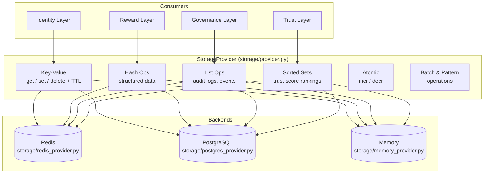

| Parameter | Default |
|-----------|---------|
| Connection timeout | 30 s |
| Pool size | 10 |

---

## 8. Cross-Repo Ecosystem

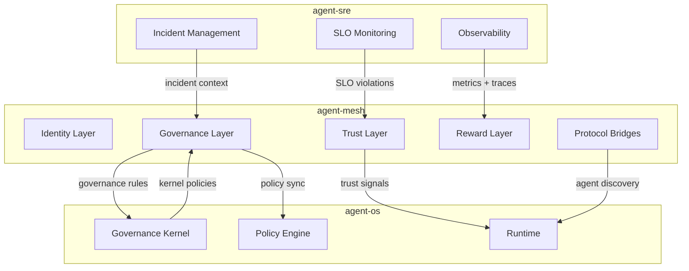

### Integration Points

| From | To | Data Flow |
|------|----|-----------|
| agent-mesh → agent-os | Governance → Policy Engine | Policy sync, governance rules |
| agent-mesh → agent-os | Trust → Runtime | Trust signals for agent scheduling |
| agent-mesh → agent-os | Integrations → Runtime | Agent discovery via AI Cards |
| agent-os → agent-mesh | Governance Kernel → Governance | Kernel-level policy constraints |
| agent-sre → agent-mesh | SLO Monitoring → Trust | SLO violations affect trust scores |
| agent-sre → agent-mesh | Incident Mgmt → Governance | Incident context for audit trails |
| agent-sre → agent-mesh | Observability → Reward | Metrics feed reputation engine |

---

*Related: [agent-os](https://github.com/imran-siddique/agent-os) · [agent-sre](https://github.com/imran-siddique/agent-sre) · GitHub Issue: agent-os#263*
