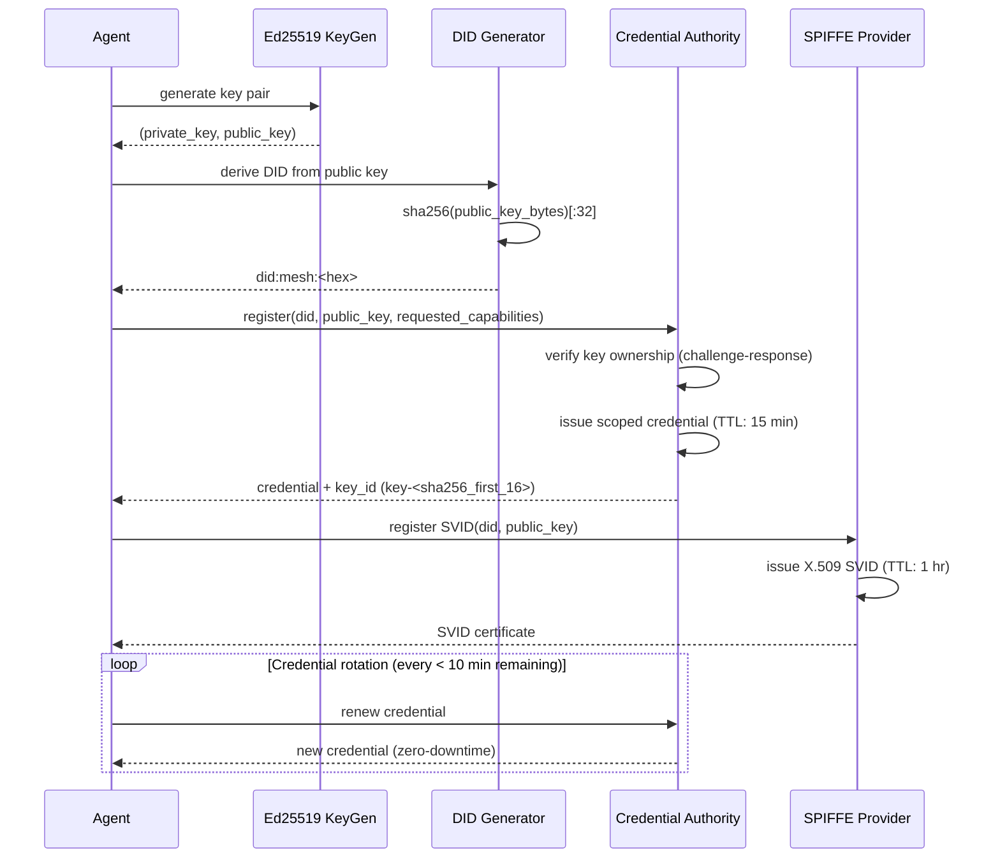
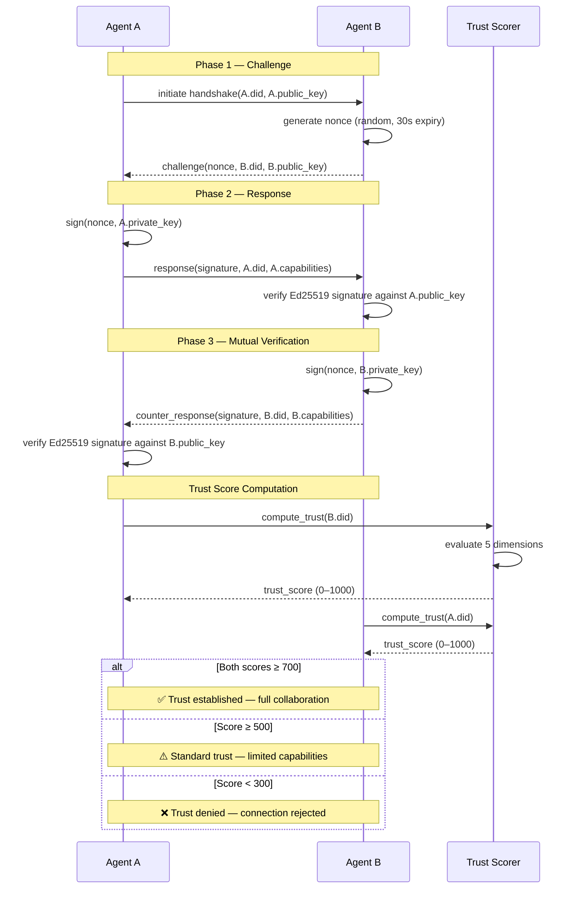
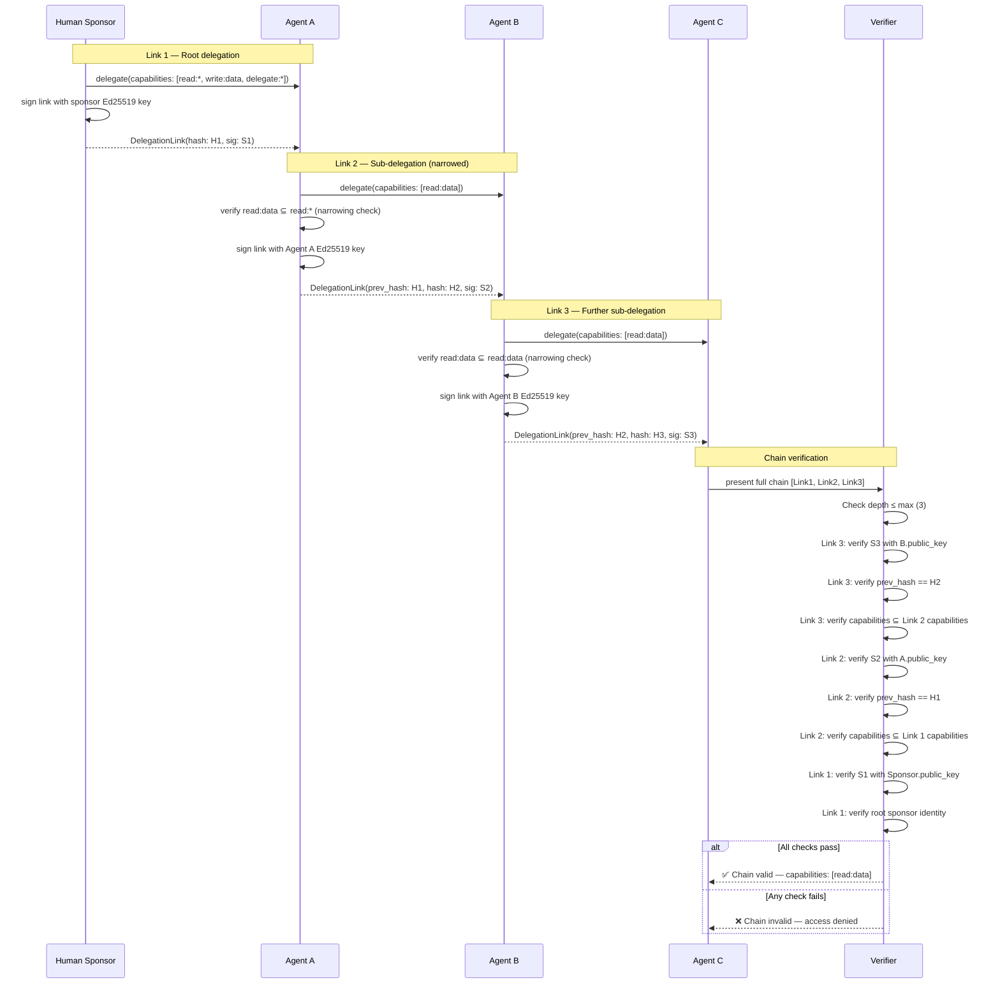
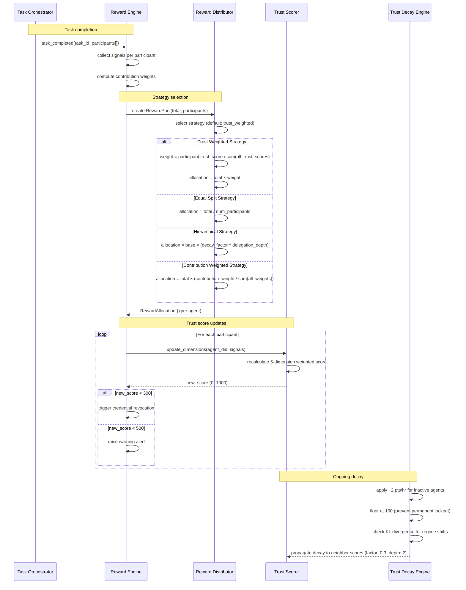

# Protocol Sequence Diagrams

This document contains Mermaid sequence diagrams for the core AgentMesh protocols.

---

## 1. Agent Registration

An agent generates its cryptographic identity, creates a DID, registers with the
credential authority, and receives scoped credentials.

---

## 2. Trust Handshake

Two agents establish mutual trust through a 3-phase challenge–response protocol with
trust score computation.

---

## 3. Scope Chain Verification

Agent A delegates to Agent B, who sub-delegates to Agent C. When Agent C presents its
chain to a verifier, the chain is walked back to the root sponsor.

---

## 4. Reward Distribution

After a task completes, the reward engine computes contributions, selects a distribution
strategy, distributes rewards, and updates trust scores.

---

## See Also

- [Architecture Overview](../ARCHITECTURE.md)
- [Trust Scoring Algorithm](trust-scoring.md)
- [ADR-001: Ed25519 Keys](adr/001-ed25519-keys.md)
- [ADR-003: Scope Chain Design](adr/003-scope-chain-design.md)
