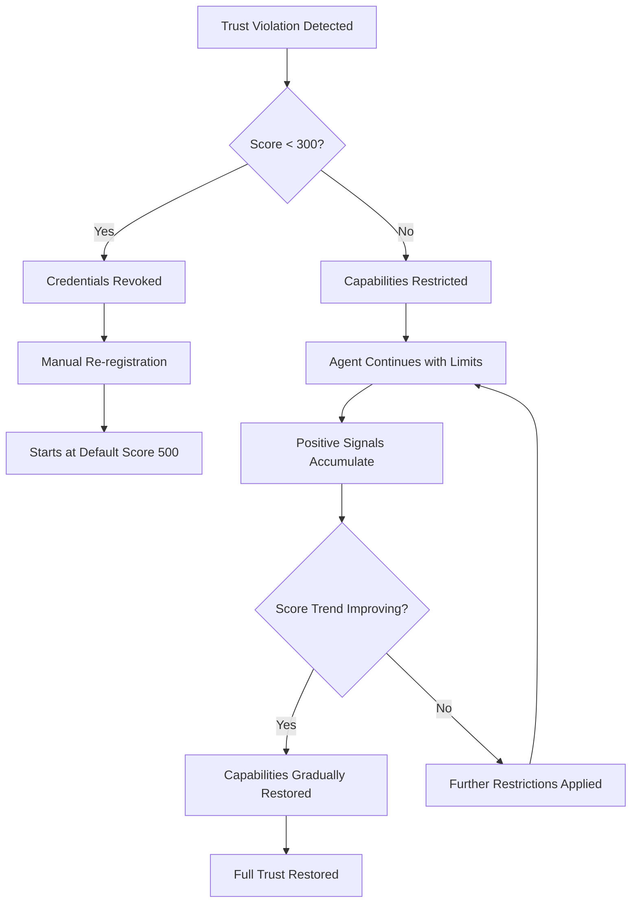

# Understanding the 5-Dimension Trust Model

> **AgentMesh's continuous, multi-dimensional trust scoring system for autonomous agent networks.**

In a multi-agent system, agents delegate tasks, share data, and make decisions on behalf of each other. Without a robust trust model, a single compromised or poorly-performing agent can cascade failures across the entire mesh. AgentMesh solves this with a **5-dimension trust model** that continuously evaluates every agent across orthogonal behavioral axes, producing a single composite score on a **0–1000 scale**.

This guide explains how the model works, how scores are calculated, and how to use it in practice.

---

## Table of Contents

- [Why Trust Matters](#why-trust-matters)
- [The 5 Dimensions](#the-5-dimensions)
- [How Scores Are Calculated](#how-scores-are-calculated)
- [Trust Tiers and Thresholds](#trust-tiers-and-thresholds)
- [Trust Decay](#trust-decay)
- [Trust Recovery](#trust-recovery)
- [Practical Examples](#practical-examples)
- [Configuration Reference](#configuration-reference)
- [Comparison with Other Approaches](#comparison-with-other-approaches)
- [Architecture Diagrams](#architecture-diagrams)

---

## Why Trust Matters

Traditional software systems rely on binary access control: an entity either has permission or it doesn't. This breaks down in multi-agent environments for three reasons:

1. **Agents are autonomous.** They make decisions without human approval at runtime, so you cannot gate every action on a human "yes/no."
2. **Behavior changes over time.** An agent that was reliable yesterday may be compromised or degraded today.
3. **Risk is contextual.** Reading a public dataset is low-risk; initiating a financial transfer is high-risk. The same agent may be trusted for one and not the other.

AgentMesh's trust model addresses all three by providing a **continuous, behaviorally-derived score** that gates capabilities dynamically. Instead of asking _"Is this agent allowed?"_, the mesh asks _"How much do we trust this agent right now, and is that enough for this operation?"_

---

## The 5 Dimensions

Every agent is scored across five independent dimensions. Each dimension captures a different facet of trustworthy behavior.

```
┌─────────────────────────────────────────────────┐
│              Trust Score (0–1000)                │
│                                                 │
│  ┌───────────┐  ┌───────────┐  ┌───────────┐   │
│  │  Policy   │  │ Security  │  │  Output   │   │
│  │Compliance │  │ Posture   │  │ Quality   │   │
│  │   (25%)   │  │   (25%)   │  │   (20%)   │   │
│  └───────────┘  └───────────┘  └───────────┘   │
│  ┌───────────┐  ┌───────────┐                   │
│  │ Resource  │  │ Collab.   │                   │
│  │Efficiency │  │ Health    │                   │
│  │   (15%)   │  │   (15%)   │                   │
│  └───────────┘  └───────────┘                   │
└─────────────────────────────────────────────────┘
```

### 1. Policy Compliance (25%)

**Question:** _Does the agent follow organizational rules and governance policies?_

Policy compliance tracks whether an agent adheres to declarative policies — YAML/Rego rules that define what actions are allowed, required, or forbidden. Every policy evaluation produces a signal: `1.0` for compliant, `0.0` for a violation.

**Signals come from:**
- The governance policy engine (`trust_policy.py`)
- Audit trail evaluations
- Regulatory compliance checks (EU AI Act, HIPAA, SOC 2)

**Example scenario:** An agent is required to include a data-lineage header in every outbound message. The policy engine checks each message and emits a compliance signal. Repeated violations drag this dimension score down, eventually restricting the agent's capabilities.

```python
engine.record_policy_compliance(
    agent_did="did:mesh:data-processor-01",
    compliant=True,
    policy_name="data-lineage-header-required",
)
```

### 2. Security Posture (25%)

**Question:** _Does the agent maintain good credential hygiene and stay within its security boundary?_

Security posture measures whether the agent handles credentials properly, avoids accessing resources outside its scope, and has no history of security incidents. This dimension carries equal weight with policy compliance because a security breach can have catastrophic impact.

**Signals come from:**
- Credential rotation checks
- Boundary violation detection
- Vulnerability scanning results
- Anomalous behavior detection

**Example scenario:** An agent attempts to access a resource outside its authorized scope. The security monitor records a boundary violation (`value=0.0`), immediately dragging the score down and triggering a score recalculation.

```python
engine.record_security_event(
    agent_did="did:mesh:analyzer-07",
    within_boundary=False,
    event_type="unauthorized_resource_access",
)
```

### 3. Output Quality (20%)

**Question:** _Do downstream consumers accept or reject this agent's output?_

Output quality is measured by peer feedback. When Agent A sends results to Agent B, Agent B reports whether the output was acceptable. This creates a market-like mechanism where agents that produce poor-quality work are identified quickly.

**Signals come from:**
- Downstream agent acceptance/rejection
- Human review outcomes
- Automated validation checks

```python
engine.record_output_quality(
    agent_did="did:mesh:summarizer-03",
    accepted=True,
    consumer="did:mesh:report-generator-01",
)
```

### 4. Resource Efficiency (15%)

**Question:** _Does the agent use compute, tokens, and time proportionally to its task?_

An agent that uses 10x the expected tokens or runs 5x longer than budgeted may be stuck in a loop, hallucinating, or being exploited. Resource efficiency compares actual usage against budgets.

**Signals come from:**
- Token usage vs. token budget
- Compute time vs. compute budget
- The efficiency score is the average of token efficiency and compute efficiency

```python
engine.record_resource_usage(
    agent_did="did:mesh:researcher-02",
    tokens_used=1200,
    tokens_budget=2000,
    compute_ms=450,
    compute_budget_ms=1000,
)
# Token efficiency: min(1.0, 2000/1200) = 1.0
# Compute efficiency: min(1.0, 1000/450) = 1.0
# Combined efficiency: 1.0 → excellent
```

### 5. Collaboration Health (15%)

**Question:** _Does the agent complete inter-agent handoffs reliably?_

In a mesh, agents frequently delegate subtasks and receive results. Collaboration health tracks whether these handoffs succeed. An agent that consistently fails to respond, returns errors, or drops tasks is penalized.

**Signals come from:**
- Handoff completion status
- Response time within SLA
- Protocol compliance (A2A, MCP, IATP)

```python
engine.record_collaboration(
    agent_did="did:mesh:planner-01",
    handoff_successful=True,
    peer_did="did:mesh:executor-05",
)
```

---

## How Scores Are Calculated

### Dimension Scores: Exponential Moving Average (EMA)

Each dimension maintains its own score (0–100) updated with every new signal using an **Exponential Moving Average**:

```
new_score = previous_score × (1 - α) + (signal_value × 100) × α
```

Where **α = 0.1** is the smoothing factor. This means:
- Recent signals influence the score, but don't dominate it
- A single bad signal won't destroy a good track record
- Sustained poor behavior will steadily lower the score

| α Value | Behavior |
|---------|----------|
| 0.05 | Very slow adaptation — history dominates |
| **0.1** | **Default — balanced responsiveness** |
| 0.2 | Fast adaptation — recent signals weigh heavily |
| 0.5 | Very reactive — nearly last-value-wins |

**Worked example:** An agent has a Policy Compliance score of 80. It receives a violation signal (`value = 0.0`):

```
new_score = 80 × (1 - 0.1) + (0.0 × 100) × 0.1
         = 80 × 0.9 + 0
         = 72.0
```

One violation drops the score by 8 points. If the next 5 signals are compliant (`value = 1.0`):

```
Signal 1: 72.0 × 0.9 + 100 × 0.1 = 74.8
Signal 2: 74.8 × 0.9 + 100 × 0.1 = 77.3
Signal 3: 77.3 × 0.9 + 100 × 0.1 = 79.6
Signal 4: 79.6 × 0.9 + 100 × 0.1 = 81.6
Signal 5: 81.6 × 0.9 + 100 × 0.1 = 83.5
```

It takes roughly 5 good signals to recover from 1 bad one — an intentional asymmetry that makes trust hard to earn and easy to lose.

### Composite Score: Weighted Sum

The 5 dimension scores combine into a single **0–1000 composite score**:

```
total = (policy × W_policy + security × W_security + quality × W_quality
       + efficiency × W_efficiency + collaboration × W_collaboration) × 10
```

With default weights:

| Dimension | Weight | Rationale |
|-----------|--------|-----------|
| Policy Compliance | 0.25 | Governance is foundational |
| Security Posture | 0.25 | Security breaches are catastrophic |
| Output Quality | 0.20 | Quality is the core value proposition |
| Resource Efficiency | 0.15 | Important but less critical |
| Collaboration Health | 0.15 | Important but less critical |

**Worked example:** An agent with these dimension scores:

| Dimension | Score (0-100) | Weight | Contribution |
|-----------|--------------|--------|-------------|
| Policy Compliance | 85 | 0.25 | 21.25 |
| Security Posture | 90 | 0.25 | 22.50 |
| Output Quality | 70 | 0.20 | 14.00 |
| Resource Efficiency | 60 | 0.15 | 9.00 |
| Collaboration Health | 75 | 0.15 | 11.25 |
| **Total (weighted)** | | | **78.00** |
| **Scaled (×10)** | | | **780** |

This agent scores **780/1000** → **Trusted** tier.

### Recency-Weighted Aggregation

When recalculating from historical signals, AgentMesh applies recency weighting: more recent signals carry more weight than older ones. This prevents stale history from masking current behavior.

```python
# From RewardEngine._recalculate_score()
for i, signal in enumerate(signals[-100:]):
    weight = 1.0 + (i / 100)  # Later signals get higher weight
    total += signal.value * weight
    weight_sum += weight
```

---

## Trust Tiers and Thresholds

Composite scores map to **trust tiers** that determine what an agent can do:

```mermaid
graph LR
    A["0–299<br/>Untrusted"] -->|"Score rises"| B["300–499<br/>Probationary"]
    B -->|"Score rises"| C["500–699<br/>Standard"]
    C -->|"Score rises"| D["700–899<br/>Trusted"]
    D -->|"Score rises"| E["900–1000<br/>Verified Partner"]
    
    E -->|"Score drops"| D
    D -->|"Score drops"| C
    C -->|"Score drops"| B
    B -->|"Score drops"| A

    style A fill:#dc3545,color:#fff
    style B fill:#fd7e14,color:#fff
    style C fill:#ffc107,color:#000
    style D fill:#28a745,color:#fff
    style E fill:#007bff,color:#fff
```



| Tier | Score Range | Capabilities | Use Case |
|------|------------|-------------|----------|
| **Untrusted** | 0–299 | Credentials revoked, peer blacklisted | Compromised or severely degraded agents |
| **Probationary** | 300–499 | Alerts raised, capabilities restricted, human oversight required | New agents or those recovering from violations |
| **Standard** | 500–699 | Normal operations within defined scope | Everyday agent operations |
| **Trusted** | 700–899 | Extended privileges, TrustBridge default gate | Proven, reliable agents |
| **Verified Partner** | 900–1000 | Maximum trust, privileged operations | Long-standing agents with excellent track records |

### Threshold Actions

| Threshold | Score | Action |
|-----------|-------|--------|
| Revocation | < 300 | Automatic credential revocation triggered |
| Warning | < 500 | Operator alerts generated |
| Allow | ≥ 500 | Standard operations permitted |

```python
from agentmesh.reward.scoring import ScoreThresholds

thresholds = ScoreThresholds(
    verified_partner=900,
    trusted=700,
    standard=500,
    probationary=300,
    revocation_threshold=300,
)

# Check tier for a score
tier = thresholds.get_tier(780)        # "trusted"
allowed = thresholds.should_allow(780) # True
warn = thresholds.should_warn(780)     # False
revoke = thresholds.should_revoke(780) # False
```

---

## Trust Decay

Trust is not permanent. If an agent goes silent — no interactions, no signals — its score decays over time. This prevents stale trust from persisting indefinitely.

### How Decay Works

AgentMesh uses **linear temporal decay**:

```
decay = decay_rate × hours_since_last_positive_signal
effective_decay = min(decay, max(0, current_score - floor))
new_score = current_score - effective_decay
```

**Default parameters:**

| Parameter | Default | Description |
|-----------|---------|-------------|
| `decay_rate` | 2.0 | Points lost per hour of inactivity |
| Floor | 100 | Minimum score (decay stops here) |

**Example:** An agent with a score of 700 goes inactive:

| Hours Inactive | Decay | New Score | Tier |
|---------------|-------|-----------|------|
| 0 | 0 | 700 | Trusted |
| 12 | 24 | 676 | Standard |
| 24 | 48 | 652 | Standard |
| 48 | 96 | 604 | Standard |
| 100 | 200 | 500 | Standard |
| 200 | 300* | 400 | Probationary |

*Capped by floor: score cannot drop below 100.

### Why Decay Matters

- **Stale credentials:** An agent that hasn't been active may have outdated credentials
- **Behavioral drift:** Software changes over time; an agent untested for weeks may behave differently
- **Attack surface:** Dormant agents are attractive targets for credential theft

### Preventing Decay

Decay resets whenever a positive signal is recorded:

```python
trust_engine.record_positive_signal(
    agent_did="did:mesh:worker-01",
    bonus=5.0,  # Small score bump + decay reset
)
```

The TypeScript SDK applies multiplicative decay (configurable via `decayFactor`):

```typescript
const manager = new TrustManager({
  decayFactor: 0.95, // 5% decay per hour of inactivity
});
```

---

## Trust Recovery

When an agent's trust score drops — due to violations, poor performance, or decay — it must rebuild trust through sustained positive behavior.

### Recovery Path



### Recovery Mechanics

1. **EMA asymmetry:** Because α = 0.1, recovering from a bad signal requires ~5 good signals. This is by design — trust should be harder to rebuild than to maintain.

2. **No shortcuts:** There is no API to manually set a trust score to a high value. Recovery must happen through genuine positive behavioral signals.

3. **Revocation recovery:** If an agent's score drops below 300, credentials are automatically revoked. The agent must be re-registered and starts at the default score of 500.

4. **Trend tracking:** The engine tracks whether an agent's score is `improving`, `degrading`, or `stable`:

```python
explanation = engine.get_score_explanation("did:mesh:recovering-agent")
print(explanation["trend"])  # "improving"
```

---

## Practical Examples

### Example 1: Setting Up the Reward Engine

```python
from agentmesh.reward.engine import RewardEngine, RewardConfig

# Create engine with custom configuration
config = RewardConfig(
    update_interval_seconds=30,
    revocation_threshold=300,
    warning_threshold=500,
    policy_compliance_weight=0.25,
    security_posture_weight=0.25,
    output_quality_weight=0.20,
    resource_efficiency_weight=0.15,
    collaboration_health_weight=0.15,
)
engine = RewardEngine(config)
```

### Example 2: Recording Signals from a Task Execution

```python
agent_did = "did:mesh:code-reviewer-01"

# Task completes successfully
engine.record_output_quality(
    agent_did=agent_did,
    accepted=True,
    consumer="did:mesh:merge-bot",
)

# Resource usage was within budget
engine.record_resource_usage(
    agent_did=agent_did,
    tokens_used=3500,
    tokens_budget=5000,
    compute_ms=800,
    compute_budget_ms=2000,
)

# Policy check passed
engine.record_policy_compliance(
    agent_did=agent_did,
    compliant=True,
    policy_name="code-review-sla",
)

# Collaboration handoff succeeded
engine.record_collaboration(
    agent_did=agent_did,
    handoff_successful=True,
    peer_did="did:mesh:merge-bot",
)
```

### Example 3: Querying and Interpreting Scores

```python
# Get the composite score
score = engine.get_agent_score(agent_did)
print(f"Score: {score.total_score}/1000")
print(f"Tier: {score.tier}")

# Get full explainable breakdown
explanation = engine.get_score_explanation(agent_did)
for dim_name, dim_data in explanation["dimensions"].items():
    print(f"  {dim_name}: {dim_data['score']:.1f}/100 "
          f"(weight={dim_data['weight']}, signals={dim_data['signal_count']})")

print(f"Trend: {explanation['trend']}")
print(f"Revoked: {explanation['revoked']}")
```

**Sample output:**
```
Score: 780/1000
Tier: trusted
  policy_compliance: 85.0/100 (weight=0.25, signals=42)
  security_posture: 90.0/100 (weight=0.25, signals=38)
  output_quality: 70.0/100 (weight=0.2, signals=156)
  resource_efficiency: 60.0/100 (weight=0.15, signals=89)
  collaboration_health: 75.0/100 (weight=0.15, signals=67)
Trend: stable
Revoked: False
```

### Example 4: Customizing Weights for a Security-Critical Deployment

```python
engine.update_weights(
    policy_compliance=0.20,
    security_posture=0.40,  # Double security weight
    output_quality=0.15,
    resource_efficiency=0.10,
    collaboration_health=0.15,
)
```

### Example 5: Monitoring At-Risk Agents

```python
# Get agents approaching revocation
at_risk = engine.get_agents_at_risk()
for agent_did in at_risk:
    explanation = engine.get_score_explanation(agent_did)
    print(f"⚠️  {agent_did}: {explanation['total_score']}/1000 ({explanation['trend']})")

# Get a full health report
report = engine.get_health_report(days=7)
print(f"Total agents: {report['total_agents']}")
print(f"Revoked: {report['revoked_agents']}")
print(f"At risk: {report['at_risk_agents']}")
```

### Example 6: Using the TypeScript SDK

```typescript
import { TrustManager } from '@agentmesh/sdk';

const manager = new TrustManager({
  initialScore: 0.5,
  decayFactor: 0.95,
  thresholds: {
    untrusted: 0.0,
    provisional: 0.3,
    trusted: 0.6,
    verified: 0.85,
  },
});

// Record interactions
manager.recordSuccess('did:mesh:helper-01', 0.05);
manager.recordFailure('did:mesh:helper-01', 0.1);

// Check trust
const score = manager.getTrustScore('did:mesh:helper-01');
console.log(`Score: ${score.overall}, Tier: ${score.tier}`);
// Score: 0.45, Tier: Provisional
```

### Example 7: Trust-Gated Capability Check

```python
from agentmesh.reward.scoring import ScoreThresholds

thresholds = ScoreThresholds()

def can_execute(agent_did: str, operation: str) -> bool:
    """Check if an agent is trusted enough for an operation."""
    score = engine.get_agent_score(agent_did)
    
    required_scores = {
        "read_public_data": 300,   # Probationary+
        "write_data": 500,         # Standard+
        "delegate_task": 700,      # Trusted+
        "manage_credentials": 900, # Verified Partner only
    }
    
    required = required_scores.get(operation, 500)
    return score.meets_threshold(required)
```

---

## Configuration Reference

### Python Constants (`agentmesh.constants`)

| Constant | Default | Description |
|----------|---------|-------------|
| `TRUST_SCORE_MIN` | 0 | Minimum possible score |
| `TRUST_SCORE_MAX` | 1000 | Maximum possible score |
| `TRUST_SCORE_DEFAULT` | 500 | Starting score for new agents |
| `TRUST_REVOCATION_THRESHOLD` | 300 | Auto-revocation trigger |
| `TRUST_WARNING_THRESHOLD` | 500 | Operator warning trigger |
| `TIER_VERIFIED_PARTNER_THRESHOLD` | 900 | Verified Partner tier |
| `TIER_TRUSTED_THRESHOLD` | 700 | Trusted tier |
| `TIER_STANDARD_THRESHOLD` | 500 | Standard tier |
| `TIER_PROBATIONARY_THRESHOLD` | 300 | Probationary tier |
| `WEIGHT_POLICY_COMPLIANCE` | 0.25 | Policy dimension weight |
| `WEIGHT_SECURITY_POSTURE` | 0.25 | Security dimension weight |
| `WEIGHT_OUTPUT_QUALITY` | 0.20 | Quality dimension weight |
| `WEIGHT_RESOURCE_EFFICIENCY` | 0.15 | Efficiency dimension weight |
| `WEIGHT_COLLABORATION_HEALTH` | 0.15 | Collaboration dimension weight |
| `REWARD_UPDATE_INTERVAL_SECONDS` | 30 | Background recalculation interval |

### NetworkTrustEngine Parameters

| Parameter | Default | Description |
|-----------|---------|-------------|
| `decay_rate` | 2.0 | Points lost per hour of inactivity |
| `propagation_factor` | 0.3 | Trust propagation to neighbors (reserved) |
| `propagation_depth` | 2 | Hops for trust propagation (reserved) |
| `regime_threshold` | 0.5 | KL divergence threshold for regime detection (reserved) |
| `history_window_hours` | 1 | Window for behavioral analysis |
| `baseline_days` | 30 | Baseline period for trend comparison |

---

## Comparison with Other Approaches

### Binary Trust (ACLs)

| Aspect | Binary Trust | AgentMesh 5-Dimension |
|--------|-------------|----------------------|
| Granularity | Allow or Deny | Continuous 0–1000 |
| Behavioral | No | Yes — derived from runtime behavior |
| Adaptive | No — manual updates | Yes — automatic EMA updates |
| Explainable | Limited | Full breakdown by dimension |
| Decay | None | Automatic time-based decay |
| **Best for** | Static systems | Dynamic agent networks |

### Reputation Systems (e.g., eBay-style)

| Aspect | Reputation Systems | AgentMesh 5-Dimension |
|--------|-------------------|----------------------|
| Dimensions | Single (rating) | 5 orthogonal dimensions |
| Input | Explicit votes | Automated behavioral signals |
| Gaming resistance | Low (Sybil attacks) | High (cryptographic identity) |
| Recency | All history equal | EMA favors recent behavior |
| Tiering | Arbitrary | Defined thresholds with actions |
| **Best for** | Human marketplaces | Machine-to-machine trust |

### Capability-Based Security (SPIFFE/SPIRE)

| Aspect | Capability-Based | AgentMesh 5-Dimension |
|--------|-----------------|----------------------|
| Trust basis | Identity + capability tokens | Identity + behavioral scoring |
| Dynamic | Token-scoped | Continuously adaptive |
| Revocation | Token expiry | Automatic on score drop |
| Behavioral insight | None | Full behavioral analytics |
| **Best for** | Service-to-service auth | Autonomous agent governance |

### Key Differentiators

1. **Multi-dimensional:** Separating trust into 5 dimensions prevents a single axis from masking problems. An agent with excellent output quality but poor security posture is correctly identified as risky.

2. **Continuous and automatic:** No human intervention needed for routine trust updates. The system learns from every interaction.

3. **Asymmetric by design:** Trust is hard to build and easy to lose — matching real-world trust dynamics.

4. **Explainable:** Every score can be traced back to specific signals, dimensions, and weights. This is critical for audit and compliance.

5. **Composable with zero-trust:** The trust model layers on top of AgentMesh's [zero-trust architecture](./zero-trust.md), adding behavioral intelligence to cryptographic identity.

---

## Architecture Diagrams

### Trust Scoring Lifecycle

```mermaid
sequenceDiagram
    participant Agent
    participant Mesh as AgentMesh Runtime
    participant RE as RewardEngine
    participant NTE as NetworkTrustEngine
    participant Policy as PolicyEngine

    Agent->>Mesh: Perform action
    Mesh->>Policy: Evaluate policy compliance
    Policy-->>RE: Compliance signal (0.0–1.0)
    Mesh->>RE: Resource usage signal
    Mesh->>RE: Security posture signal
    
    Note over RE: EMA update per dimension
    RE->>RE: Recalculate composite score
    
    alt Score < 300
        RE->>Agent: 🔴 Credentials revoked
    else Score < 500
        RE->>Mesh: ⚠️ Warning alert
    else Score ≥ 500
        RE->>Mesh: ✅ Normal operation
    end

    NTE->>NTE: Apply temporal decay (periodic)
    NTE-->>RE: Decayed scores
```



### Score Calculation Flow

```mermaid
flowchart TD
    S1[Signal: policy_compliance = 1.0] --> D1[Dimension: Policy Compliance]
    S2[Signal: security_posture = 0.8] --> D2[Dimension: Security Posture]
    S3[Signal: output_quality = 1.0] --> D3[Dimension: Output Quality]
    S4[Signal: resource_efficiency = 0.6] --> D4[Dimension: Resource Efficiency]
    S5[Signal: collaboration_health = 1.0] --> D5[Dimension: Collaboration Health]

    D1 -->|"EMA: score × 0.9 + signal × 10"| E1["Score: 85/100"]
    D2 -->|"EMA: score × 0.9 + signal × 10"| E2["Score: 90/100"]
    D3 -->|"EMA: score × 0.9 + signal × 10"| E3["Score: 70/100"]
    D4 -->|"EMA: score × 0.9 + signal × 10"| E4["Score: 60/100"]
    D5 -->|"EMA: score × 0.9 + signal × 10"| E5["Score: 75/100"]

    E1 -->|"× 0.25"| W["Weighted Sum"]
    E2 -->|"× 0.25"| W
    E3 -->|"× 0.20"| W
    E4 -->|"× 0.15"| W
    E5 -->|"× 0.15"| W

    W -->|"× 10"| T["Total: 780 / 1000"]
    T --> Tier["Tier: Trusted"]
```



### Trust Tier State Machine

```mermaid
stateDiagram-v2
    [*] --> Standard: Agent registers (default 500)
    
    Standard --> Trusted: Score ≥ 700
    Standard --> Probationary: Score < 500
    
    Trusted --> VerifiedPartner: Score ≥ 900
    Trusted --> Standard: Score < 700
    
    VerifiedPartner --> Trusted: Score < 900
    
    Probationary --> Standard: Score ≥ 500
    Probationary --> Untrusted: Score < 300
    
    Untrusted --> Probationary: Re-registration (reset to 500)
    
    state Untrusted {
        [*] --> Revoked: Credentials auto-revoked
        Revoked --> [*]: Manual re-registration
    }
```



---

## Further Reading

- [Zero-Trust Architecture in AgentMesh](./zero-trust.md)
- [Trust Scoring API Reference](./trust-scoring-api.md)
- [AgentMesh Architecture](../ARCHITECTURE.md)
- [Security Policy](../SECURITY.md)
