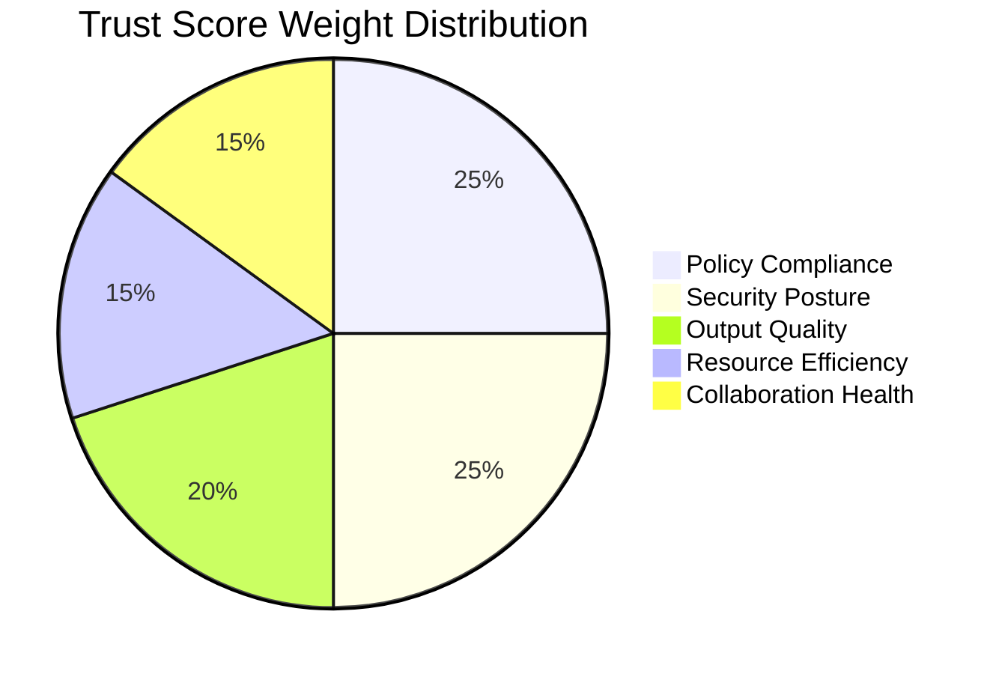
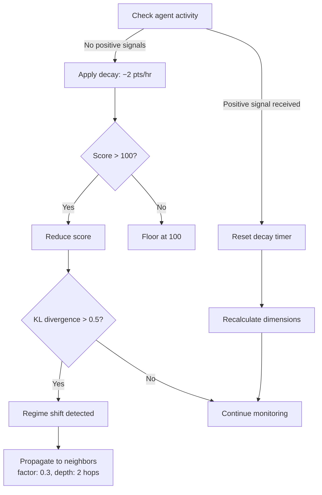
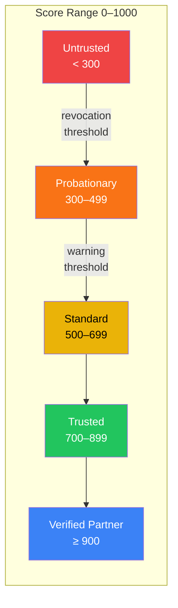
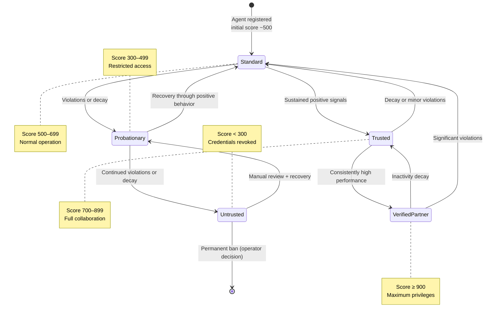

# Trust Scoring Algorithm

AgentMesh uses a **5-dimension weighted trust scoring system** on a 0–1000 integer scale
to evaluate agent reliability. This document explains the scoring model, calculation
formula, decay mechanics, and threshold-driven governance actions.

## Overview

Every agent in AgentMesh has a **trust score** between 0 and 1000. The score is computed
as a weighted combination of five independently tracked dimensions:

| Dimension | Weight | What It Measures |
|-----------|--------|------------------|
| **Policy Compliance** | 25% | Adherence to governance rules and policy engine verdicts |
| **Security Posture** | 25% | Credential hygiene, key rotation, vulnerability posture |
| **Output Quality** | 20% | Task success rate, accuracy, result validation |
| **Resource Efficiency** | 15% | Compute/token/memory usage vs. allocated budget |
| **Collaboration Health** | 15% | Responsiveness, protocol compliance, handshake success |



Key design properties:

- **Dimension isolation**: A drop in one dimension does not automatically tank the entire
  score — each dimension is independently observable and diagnosable.
- **Configurable weights**: Deployments can override weights (must sum to 1.0). A
  healthcare deployment might set `security_posture: 0.40` while reducing
  `resource_efficiency: 0.05`.
- **Integer scale**: No floating-point comparison issues in policy rules; threshold
  checks are simple integer comparisons.

## Score Calculation Formula

Each dimension is scored independently on a 0–100 scale based on recent signals, then
combined using the weighted formula:

```
TrustScore = round(
    (policy_compliance  × 0.25 +
     security_posture   × 0.25 +
     output_quality     × 0.20 +
     resource_efficiency × 0.15 +
     collaboration_health × 0.15) × 10
)
```

The `× 10` scaling maps the 0–100 weighted average to the 0–1000 output range.

### Worked Example 1: Healthy Agent

An agent with strong compliance and security but average resource usage:

| Dimension | Raw Score (0–100) | Weight | Contribution |
|-----------|-------------------|--------|--------------|
| Policy Compliance | 92 | × 0.25 | 23.00 |
| Security Posture | 88 | × 0.25 | 22.00 |
| Output Quality | 85 | × 0.20 | 17.00 |
| Resource Efficiency | 60 | × 0.15 | 9.00 |
| Collaboration Health | 78 | × 0.15 | 11.70 |
| **Weighted sum** | | | **82.70** |
| **Trust Score** | | | **827** |

Result: **827** → Tier: **Trusted** (≥ 700)

### Worked Example 2: Agent With Security Issues

An agent with a recent credential hygiene failure:

| Dimension | Raw Score (0–100) | Weight | Contribution |
|-----------|-------------------|--------|--------------|
| Policy Compliance | 75 | × 0.25 | 18.75 |
| Security Posture | 30 | × 0.25 | 7.50 |
| Output Quality | 80 | × 0.20 | 16.00 |
| Resource Efficiency | 70 | × 0.15 | 10.50 |
| Collaboration Health | 65 | × 0.15 | 9.75 |
| **Weighted sum** | | | **62.50** |
| **Trust Score** | | | **625** |

Result: **625** → Tier: **Standard** (≥ 500). The low Security Posture dimension is
clearly visible in the breakdown, enabling targeted remediation.

### Worked Example 3: Agent Approaching Revocation

An agent with multiple policy violations and anomalies:

| Dimension | Raw Score (0–100) | Weight | Contribution |
|-----------|-------------------|--------|--------------|
| Policy Compliance | 15 | × 0.25 | 3.75 |
| Security Posture | 25 | × 0.25 | 6.25 |
| Output Quality | 40 | × 0.20 | 8.00 |
| Resource Efficiency | 35 | × 0.15 | 5.25 |
| Collaboration Health | 20 | × 0.15 | 3.00 |
| **Weighted sum** | | | **26.25** |
| **Trust Score** | | | **263** |

Result: **263** → **Revocation** (< 300). Credentials are automatically revoked and
the agent is blacklisted until manual review.

## Trust Decay Mechanism

Trust scores decay over time when an agent has no positive signals. This prevents stale
high-trust agents from operating unchecked after becoming inactive.

### Decay Parameters

| Parameter | Value | Description |
|-----------|-------|-------------|
| Decay rate | −2.0 pts/hr | Applied when no positive signals received |
| Minimum floor | 100 | Score cannot drop below this (prevents permanent lockout) |
| Signal window | 24 hours | Only recent signals carry full weight |
| Recalculation interval | ≤ 30 seconds | Background score refresh |
| Regime detection threshold | KL divergence > 0.5 | Triggers behavioral shift alert |
| Propagation factor | 0.3 | How much decay propagates to neighbor agents |
| Propagation depth | 2 hops | Maximum network distance for decay propagation |

### Decay Flow



### Decay Example

An agent with a score of 800 that becomes inactive:

| Hours Inactive | Score | Tier |
|----------------|-------|------|
| 0 | 800 | Trusted |
| 24 | 752 | Trusted |
| 48 | 704 | Trusted |
| 72 | 656 | Standard |
| 100 | 600 | Standard |
| 150 | 500 | Warning threshold |
| 200 | 400 | Probationary |
| 250 | 300 | Revocation threshold |
| 350 | 100 | Floor (cannot drop further) |

## How Agents Improve Their Scores

Agents increase their trust scores through consistent positive behavior across all five
dimensions:

### Positive Signal Sources

| Dimension | Actions That Improve Score |
|-----------|---------------------------|
| **Policy Compliance** | Pass policy evaluations, stay within rate limits, no governance violations |
| **Security Posture** | Rotate credentials on time, pass signature verification, no failed authentications |
| **Output Quality** | Complete tasks successfully, produce validated results, low error rate |
| **Resource Efficiency** | Stay within compute/token budgets, optimize resource usage |
| **Collaboration Health** | Respond to handshakes promptly, complete protocol exchanges, low timeout rate |

### Score Recovery Path

An agent recovering from a low score (e.g., after a security incident):

1. **Immediate**: Fix the root cause (e.g., rotate compromised credentials)
2. **Short-term** (hours): Positive signals from successful interactions start flowing
3. **Medium-term** (days): Consistent compliance raises dimension scores
4. **Long-term** (weeks): Agent returns to previous tier through sustained good behavior

The recovery rate depends on signal frequency — an active agent producing many positive
signals recovers faster than one with sparse interactions.

## Thresholds and Tiers

Trust score thresholds trigger automatic governance actions:



### Threshold Details

| Threshold | Score | Automatic Action |
|-----------|-------|------------------|
| **Revocation** | < 300 | Credentials revoked, agent blacklisted, all delegation chains invalidated |
| **Warning** | < 500 | Alert raised to operators, capabilities restricted, approval required for sensitive actions |
| **Standard** | ≥ 500 | Normal operation, standard permissions |
| **Trusted** | ≥ 700 | Full collaboration allowed, TrustBridge default threshold, can participate in delegation chains |
| **Verified Partner** | ≥ 900 | Maximum privileges, can sponsor other agents, endorsements carry extra weight |

### Tier Permissions

| Tier | Permissions | Restrictions |
|------|-------------|-------------|
| **Untrusted** (< 300) | None | All access revoked |
| **Probationary** (300–499) | Read-only | Write/delegate blocked, heavily monitored |
| **Standard** (500–699) | Read + Write | Delegation limited, sensitive actions require approval |
| **Trusted** (700–899) | Read + Write + Delegate | Full collaboration, can sub-delegate |
| **Verified Partner** (≥ 900) | All | Can sponsor agents, endorsements amplified |

## Score Lifecycle



## Trust Score API

Query an agent's trust score with full dimension breakdown:

```bash
GET /api/v1/trust/{agent_did}
```

```json
{
  "agent_did": "did:mesh:a1b2c3d4e5f6...",
  "score": 827,
  "tier": "trusted",
  "dimensions": {
    "policy_compliance": { "score": 92, "weight": 0.25, "contribution": 230 },
    "security_posture": { "score": 88, "weight": 0.25, "contribution": 220 },
    "output_quality": { "score": 85, "weight": 0.20, "contribution": 170 },
    "resource_efficiency": { "score": 60, "weight": 0.15, "contribution": 90 },
    "collaboration_health": { "score": 78, "weight": 0.15, "contribution": 117 }
  },
  "decay": {
    "rate": 2.0,
    "last_positive_signal": "2025-01-15T10:30:00Z",
    "hours_since_signal": 0.5
  },
  "updated_at": "2025-01-15T10:30:00Z"
}
```

## Trust Decisions in Policies

Use trust scores in governance policy conditions:

```yaml
rules:
  - name: require-trusted-for-sensitive
    condition: "agent.trust_score >= 700"
    action: allow

  - name: warn-on-standard
    condition: "agent.trust_score >= 500 and agent.trust_score < 700"
    action: require_approval
    approvers: ["security-team"]

  - name: block-low-trust
    condition: "agent.trust_score < 500"
    action: deny
```

## See Also

- [Architecture Overview](../ARCHITECTURE.md) — 4-layer trust stack and scoring model
- [ADR-002: Trust Scoring Algorithm](adr/002-trust-scoring-algorithm.md) — Design rationale
- [Sequence Diagrams](sequences.md) — Trust handshake and reward distribution flows
- [Zero-Trust Architecture](zero-trust.md)
- [Identity Management](identity.md)
